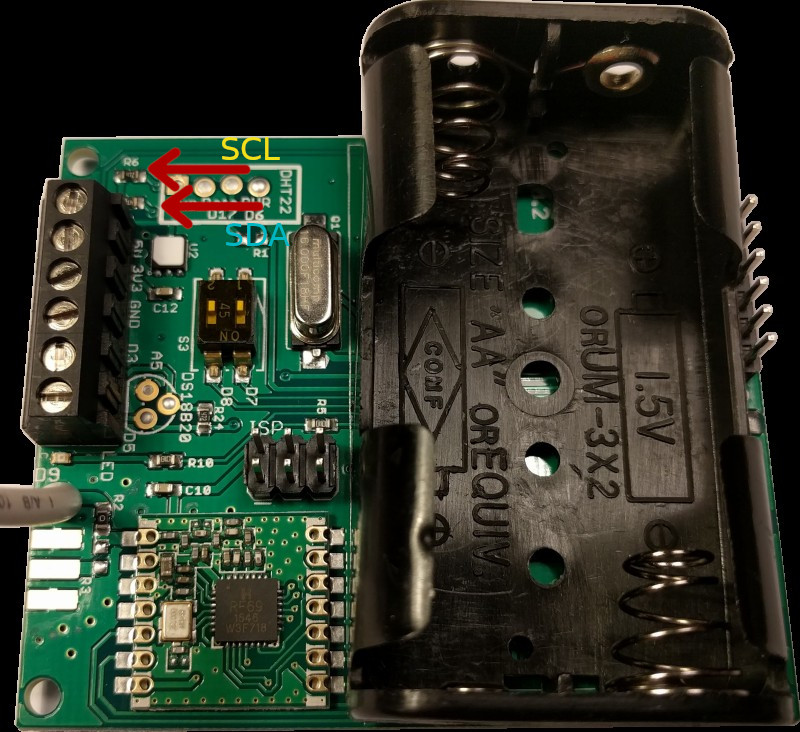

# emonTH & Telaire

This project is a modification to include the Telaire T9602 sensors of Humidity and temperature in emonTH
The starting point is the version of project V3.2.4 of [emonth2] (https://travis-ci.org/openenergymonitor/emonth2)
The solution consists of:
- A sensor Si7021 of internal temperature and humidity
- 2 external sensors 18B20
- 3 Telaire T9602 sensors

**Low power wireless temperature and humidity node**

The emonTH V2 is an open-source, wireless, battery powered temperature and humidity monitoring node.

Data from the emonTH is transmitted via wireless RF (433MHz) to an emonPi / emonBase web-connected base-station for logging to Emoncms for data logging, processing and graphing.





### Open-Hardware 

- Hardware schematic & CAD files are in the `hardware` folder of this repo
- See [emonTH V1 Technical Wiki](https://wiki.openenergymonitor.org/index.php/EmonTH_V1.5) for more hardware design notes.

# Firmware

## Pre-compiled 

Either upload pre-compiled firmware (from github releases) using our [emonUpload tool](https://github.com/openenergymonitor/emonupload) or compile and upload

## Compile & Upload

PlatformIO is recommended as the easiest way to compile and upload Arduino compatible firmware for emonTH. One of the big advantages of using PlatformIO is all libraries can be automatically downloaded. Arduino IDE can also be used but libraries must be manually installed.

## Compile & Upload Firmware Using PlatformIO

For a full guide and installing and using PlatformIO (including visual IDE) see ['Compiling' User Guide Section](https://guide.openenergymonitor.org/technical/compiling). Assuming platformIO is installed

```
$ git clone https://github.com/openenergymonitor/emonth2
$ cd emonth2
$ pio run
$ pio -t upload
```

# Hardware

emonTH hardware is fully open-source. See `hardware` folder of this repo for Gerbers, Eagle CAD design, BOM & port map.

